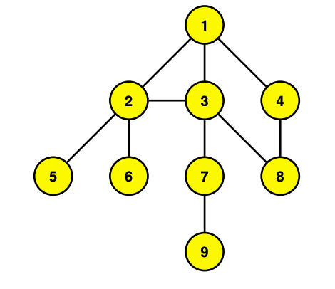

# Depth-First Search (DFS)

## Authors
- Emilio Popovits Blake (A01027265)
- Patricio Tena (A01027293)
- Ana Paola Minchaca (A01026744)
- Rodrigo Benavente (A01026973)

## Instructions
An undirected graph *G=(V,E)* specified by the set {(*i*, *j*) | where *i*, *j* &isin; {1, ... , *n*} are nodes of *G*.}

As a sample input format was not specified in the instructions, the input format was inferred with the use of the following context based on the well defined mathematical input above.

### Context
A graph is an ordered pair *G(V,E)* where *V* is a set of vertices and *E* is a set of edges.

Nodes are typically represented as *vi*, where *i* &isin; {1, ... , #(*V*)}, while edges are represented by pairs of the form (*va*, *vb*), where *a*, *b* &isin; {1, ... , #(*V*)}.

From this, the inferred input will look more or less as follows:

```sh
G = [[v1,...,vn],[[v1,v2],[v1,v3],...,[va,vb]]]
```

## Input
Each undirected graph must be saved as a .txt file individually inside '/Graphs' directory for the program to run properly in the following format:

```sh
[[v1,...,vn],[[v1,v2],[v1,v3],...,[va,vb]]]
```

In more simple terms, `[V,E]`, where *V* is an array of nodes of the tree and *E* is an array of edges. Each edge within the edges *E* array is written as an array `[va,vb]`.

### Sample Input
This sample input describes the undirected graph shown in the Depth-First Search presentation in class:
```sh
[[v1,v2,v3,v4,v5,v6,v7,v8,v9],[[v1,v2],[v1,v3],[v1,v4],[v2,v1],[v2,v3],[v2,v5],[v2,v6],[v3,v1],[v3,v2],[v3,v7],[v3,v8],[v4,v1],[v4,v8],[v5,v2],[v6,v2],[v7,v3],[v7,v9],[v8,v3],[v8,v4],[v9,v7]]]
```



## Output

This program outputs a visualization of *G* as it is traversed (every iteration), together with stack *stack* and an array of visited nodes *visitedList*.

In addition, it displays an ordered list *L* of nodes of *G*, where the order of *L* is that of traversing *G* by DFS.

### Sample Output:
```sh
Files in ./Graphs/ directory:
1. /sampleinput.txt

Which file number contains the undirected graph G that you want to run DFS on?: 1

Recieved undirected graph G string:
[[v1,v2,v3,v4,v5,v6,v7,v8,v9],[[v1,v2],[v1,v3],[v1,v4],[v2,v1],[v2,v3],[v2,v5],[v2,v6],[v3,v1],[v3,v2],[v3,v7],[v3,v8],[v4,v1],[v4,v8],[v5,v2],[v6,v2],[v7,v3],[v7,v9],[v8,v3],[v8,v4],[v9,v7]]]

Node Graph (Table form):
Node    Neighbors
---------------------------
v1       ['v2', 'v3', 'v4']
v2       ['v1', 'v3', 'v5', 'v6']
v3       ['v1', 'v2', 'v7', 'v8']
v4       ['v1', 'v8']
v5       ['v2']
v6       ['v2']
v7       ['v3', 'v9']
v8       ['v3', 'v4']
v9       ['v7']

Initial Condition:
----------------------------
Stack: []
Visited Node List: []

Iteration 0
----------------------------
Current Node: v1
Current Node Neighbors:  ['v2', 'v3', 'v4']
Visited Node List:  ['v1']
Stack:  ['v1']
Next Node: v2

Iteration 1
----------------------------
Current Node: v2
Current Node Neighbors:  ['v1', 'v3', 'v5', 'v6']
Visited Node List:  ['v1', 'v2']
Stack:  ['v1', 'v2']
Next Node: v6

Iteration 2
----------------------------
Current Node: v6
Current Node Neighbors:  ['v2']
Visited Node List:  ['v1', 'v2', 'v6']
Stack:  ['v1', 'v2', 'v6']

** No unvisited neighbors, popping node v6 from stack **
Stack:  ['v1', 'v2']
Next Node: v2

Iteration 3
----------------------------
Current Node: v2
Current Node Neighbors:  ['v1', 'v3', 'v5', 'v6']
Visited Node List:  ['v1', 'v2', 'v6']
Stack:  ['v1', 'v2']
Next Node: v5

Iteration 4
----------------------------
Current Node: v5
Current Node Neighbors:  ['v2']
Visited Node List:  ['v1', 'v2', 'v6', 'v5']
Stack:  ['v1', 'v2', 'v5']

** No unvisited neighbors, popping node v5 from stack **
Stack:  ['v1', 'v2']
Next Node: v2

Iteration 5
----------------------------
Current Node: v2
Current Node Neighbors:  ['v1', 'v3', 'v5', 'v6']
Visited Node List:  ['v1', 'v2', 'v6', 'v5']
Stack:  ['v1', 'v2']
Next Node: v3

Iteration 6
----------------------------
Current Node: v3
Current Node Neighbors:  ['v1', 'v2', 'v7', 'v8']
Visited Node List:  ['v1', 'v2', 'v6', 'v5', 'v3']
Stack:  ['v1', 'v2', 'v3']
Next Node: v8

Iteration 7
----------------------------
Current Node: v8
Current Node Neighbors:  ['v3', 'v4']
Visited Node List:  ['v1', 'v2', 'v6', 'v5', 'v3', 'v8']
Stack:  ['v1', 'v2', 'v3', 'v8']
Next Node: v4

Iteration 8
----------------------------
Current Node: v4
Current Node Neighbors:  ['v1', 'v8']
Visited Node List:  ['v1', 'v2', 'v6', 'v5', 'v3', 'v8', 'v4']
Stack:  ['v1', 'v2', 'v3', 'v8', 'v4']

** No unvisited neighbors, popping node v4 from stack **
Stack:  ['v1', 'v2', 'v3', 'v8']
Next Node: v8

Iteration 9
----------------------------
Current Node: v8
Current Node Neighbors:  ['v3', 'v4']
Visited Node List:  ['v1', 'v2', 'v6', 'v5', 'v3', 'v8', 'v4']
Stack:  ['v1', 'v2', 'v3', 'v8']

** No unvisited neighbors, popping node v8 from stack **
Stack:  ['v1', 'v2', 'v3']
Next Node: v3

Iteration 10
----------------------------
Current Node: v3
Current Node Neighbors:  ['v1', 'v2', 'v7', 'v8']
Visited Node List:  ['v1', 'v2', 'v6', 'v5', 'v3', 'v8', 'v4']
Stack:  ['v1', 'v2', 'v3']
Next Node: v7

Iteration 11
----------------------------
Current Node: v7
Current Node Neighbors:  ['v3', 'v9']
Visited Node List:  ['v1', 'v2', 'v6', 'v5', 'v3', 'v8', 'v4', 'v7']
Stack:  ['v1', 'v2', 'v3', 'v7']
Next Node: v9

Iteration 12
----------------------------
Current Node: v9
Current Node Neighbors:  ['v7']
Visited Node List:  ['v1', 'v2', 'v6', 'v5', 'v3', 'v8', 'v4', 'v7', 'v9']
Stack:  ['v1', 'v2', 'v3', 'v7', 'v9']

** No unvisited neighbors, popping node v9 from stack **
Stack:  ['v1', 'v2', 'v3', 'v7']
Next Node: v7

Iteration 13
----------------------------
Current Node: v7
Current Node Neighbors:  ['v3', 'v9']
Visited Node List:  ['v1', 'v2', 'v6', 'v5', 'v3', 'v8', 'v4', 'v7', 'v9']
Stack:  ['v1', 'v2', 'v3', 'v7']

** No unvisited neighbors, popping node v7 from stack **
Stack:  ['v1', 'v2', 'v3']
Next Node: v3

Iteration 14
----------------------------
Current Node: v3
Current Node Neighbors:  ['v1', 'v2', 'v7', 'v8']
Visited Node List:  ['v1', 'v2', 'v6', 'v5', 'v3', 'v8', 'v4', 'v7', 'v9']
Stack:  ['v1', 'v2', 'v3']

** No unvisited neighbors, popping node v3 from stack **
Stack:  ['v1', 'v2']
Next Node: v2

Iteration 15
----------------------------
Current Node: v2
Current Node Neighbors:  ['v1', 'v3', 'v5', 'v6']
Visited Node List:  ['v1', 'v2', 'v6', 'v5', 'v3', 'v8', 'v4', 'v7', 'v9']
Stack:  ['v1', 'v2']

** No unvisited neighbors, popping node v2 from stack **
Stack:  ['v1']
Next Node: v1

Iteration 16
----------------------------
Current Node: v1
Current Node Neighbors:  ['v2', 'v3', 'v4']
Visited Node List:  ['v1', 'v2', 'v6', 'v5', 'v3', 'v8', 'v4', 'v7', 'v9']
Stack:  ['v1']

** No unvisited neighbors, popping node v1 from stack **
Stack:  []

Finished Iterating.

Order L of traversing graph G by DFS:
----------------------------
L:  ['v1', 'v2', 'v6', 'v2', 'v5', 'v2', 'v3', 'v8', 'v4', 'v8', 'v3', 'v7', 'v9', 'v7', 'v3', 'v2', 'v1']
```